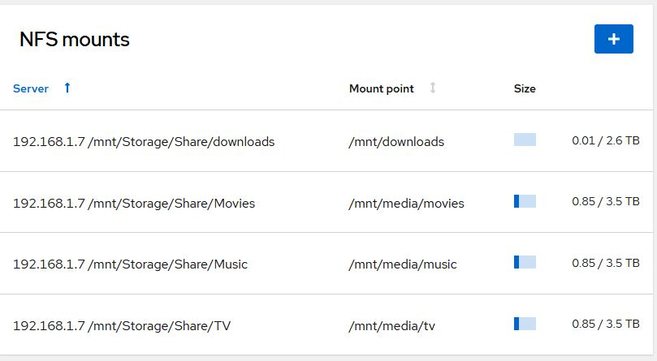
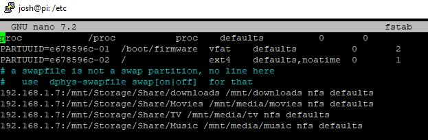
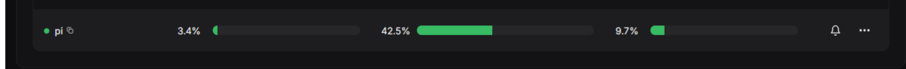

# ARR-Server-RaspberryPi

As True NAS is dropping support for Kubernetes and True Charts has now been dropped, I have been having trouble with some apps and Jellyfin has completely stopped working.  I have decided to move all services to my Raspberri Pi. 

Docker will be used for deployment and management.

The Pi is a Raspberri Pi 4.

- 4 cores
- 4 gig of ram

Media will still be stored on the NAS and shared via NFS Shares.

[Cockpit](https://cockpit-project.org/) will be installed and makes it easier to deploy connections to the NFS shares without have to do it via command line in `etc/fstab`

#### Cockpit Output after adding shares:



#### Output from `/etc/fstab`



### Self Hosted Guide

#### Apps Used

Gluetun and Deluge are deployed as a stack and are part of the Gluetun network.

All other apps are deployed seperately to each other but part of the same docker network.

#### Name docker network `media`

```markdown
docker network create media
```

##### Connecting services when connected to the same docker network. You can use the docker network ip address

Jellyfin will not be deployed within this docker network and will be in its own LXC container with hardware acceleration

- Gluetun - VPN
- [Deluge](https://docs.linuxserver.io/images/docker-deluge/?h=deluge#supported-architectures) - Torrent Downloader
- [Prowlarr](https://docs.linuxserver.io/images/docker-prowlarr/?h=pro#version-tags) - Media Search
- [Sonarr](https://docs.linuxserver.io/images/docker-sonarr/?h=so) - Media Organiser
- [Sabnzdb](https://docs.linuxserver.io/images/docker-sabnzbd/?h=sab) - News Downloader
- [Radarr](https://docs.linuxserver.io/images/docker-radarr/?h=radarr) - Media Organiser
- [Jellyfin](https://docs.linuxserver.io/images/docker-jellyfin/?h=jelly) - Self Hosted Software Media System
- [Jellyseerr](https://github.com/Fallenbagel/jellyseerr) - Media Browser
- [Flaresolverr](https://github.com/FlareSolverr/FlareSolverr) - FlareSolverr is a proxy server to bypass Cloudflare and DDoS-GUARD protection.

#### Flaresolverr is nesessary when dealing with some torrent sites. Used in Prowler media search

### System Resources at time of upload

### **Raspberri Pi 4**

- 4 Core ARM

- 4 gig Ram

- 128g SSD

